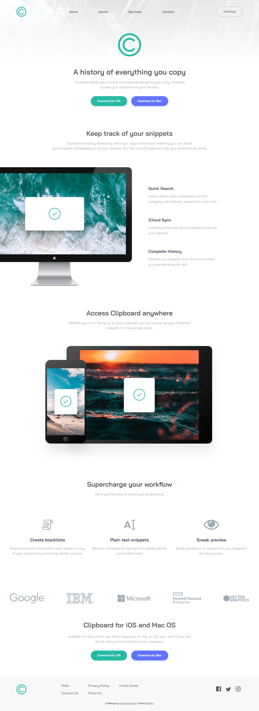
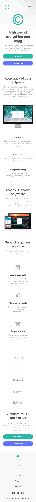
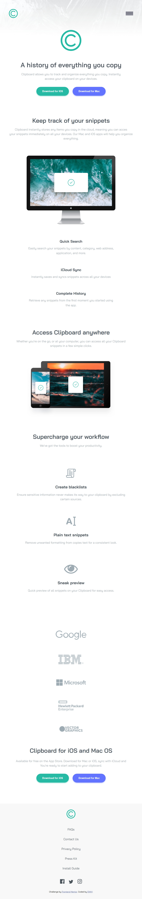

# Frontend Mentor - Clipboard landing page solution
 
This is my solution to the [Clipboard landing page challenge on Frontend Mentor](https://www.frontendmentor.io/challenges/clipboard-landing-page-5cc9bccd6c4c91111378ecb9).  This challenge helped me practice building responsive layouts using semantic HTML and CSS while improving my understanding of Flexbox and responsive design. 
## Table of contents

- [Overview](#overview)
  - [The challenge](#the-challenge)
  - [Screenshot](#screenshot)
  - [Links](#links)
- [My process](#my-process)
  - [Built with](#built-with)
  - [AI Collaboration](#ai-collaboration)

## Overview

### The challenge

Users should be able to:

- View the optimal layout for the site depending on their device's screen size
- See hover states for all interactive elements on the page

### Screenshot

<!-- 
 -->

### Links

- Solution URL: [solution URL](https://github.com/lekaneniola476-commits/clipboard-landing-page-master)
- Live Site URL: [live site URL]()

## My process

### Built with

- Semantic HTML5 markup
- CSS custom properties
- Flexbox
- CSS Grid
- Mobile-first workflow
- [Styled Components](https://styled-components.com/) - For styles

### AI Collaboration

i used CHATGPT  for some clearification and more understanding

## Author

- Website - [ENNY]()
- Frontend Mentor - [@lekaneniola476-commits](https://www.frontendmentor.io/profile/lekaneniola476-commits)
- Twitter - [@rising476](https://x.com/rising476)